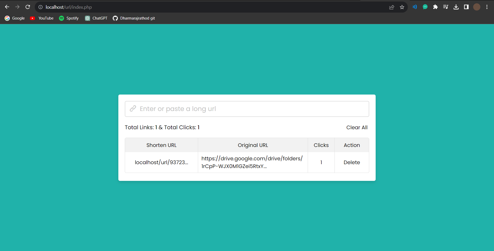

# URL Shortener Project

<p align="center">
  
</p>


- A URL shortener is a service that helps take longer URLs (which can be more than a hundred characters) and transform/convert them into manageable or short links that rarely pass 20 characters. 
- In this project [URL Shortener Website], there is only an input field on the website to enter or paste a long URL and a button to shorten the long URL. 
- This input field has full validation that means the user can only type or enter a URL to shorten it.

- When the user types a valid long URL and clicks on the shorten button then there is appears a popup box with a short url/link and a save button to edit or save the short URL. 
- Users can only change or edit the short URL at that time, later it can’t be changed. 
- Once the user clicks on the save button then the page will reload and there is shown the user’s created short URL, long URL, clicks, and a delete button to delete the particular row or link from the URLs area section.

## Introduction

The URL Shortener is a web application built with PHP and a SQL database that simplifies the process of converting long, unwieldy URLs into short, shareable links. This project is designed to streamline link sharing while providing insights through click analytics. Users can create, manage, and share shortened URLs with ease.


## Features

- **Shorten URLs:** Convert long URLs into short, memorable links with a single click.
- **Custom Aliases:** Generate custom aliases for your short URLs to make them more user-friendly.
- **Analytics:** Track click statistics, including location and referral data, for each shortened URL.
- **User Authentication:** Allow users to register accounts and manage their shortened URLs.
- **User Dashboard:** Provide a user-friendly interface for viewing and editing shortened URLs.
- **Database Storage:** Securely store URLs and analytics data in a SQL database.
- **Responsive Design:** Ensure seamless access and usability on various devices.

## Technologies Used

- **PHP:** Server-side scripting language for URL processing and user authentication.
- **SQL Database:** Stores original URLs, shortened URLs, and click analytics data.
- **HTML/CSS:** Front-end for the user interface and design.
- **JavaScript:** Enhances user experience and provides interactive features.
- **Bootstrap:** Framework for responsive web design.
- **AJAX:** Enables asynchronous requests for real-time updates without page refresh.

## Getting Started

### Prerequisites

- Web server (localhost) with PHP support
- MySQL or compatible database server(localhost/phpadmin)
- Git (optional)

### Installation

1. Clone this repository to your web server directory:

   ```bash
   git clone https://github.com/yourusername/url-shortener.git
